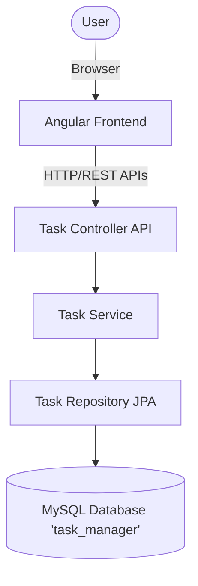
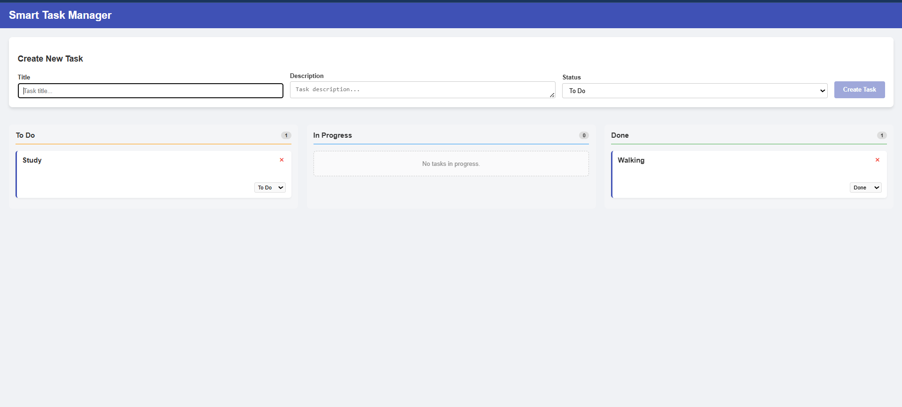
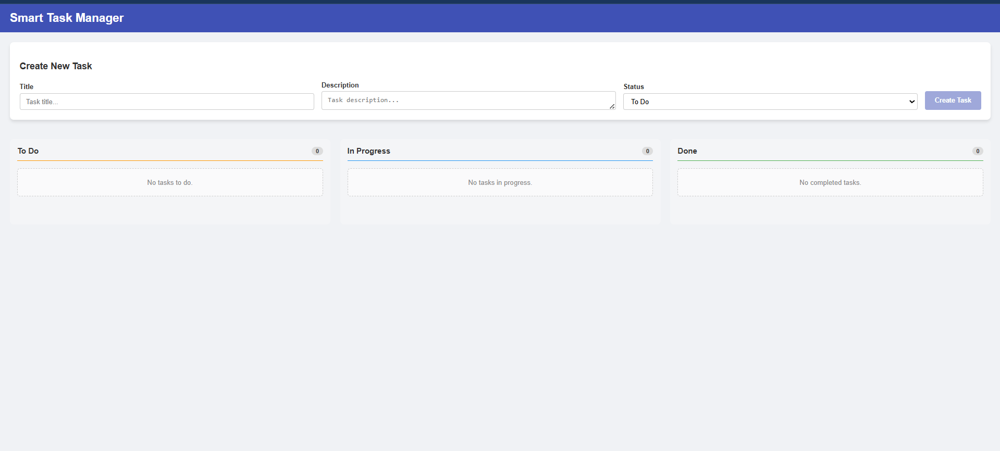

# Smart Task Manager

A Kanban-style task management application built with Angular (frontend) and Spring Boot (backend).

## Project Overview

Smart Task Manager is a full-stack web application designed to help users track and manage their tasks. It features a Kanban board with "To Do", "In Progress", and "Done" columns. The application allows you to create new tasks, update their status by moving them between columns, and delete tasks.

## Tech Stack

- **Frontend**: Angular 17/18, TypeScript, HTML/CSS
- **Backend**: Spring Boot 3, Java 21, Spring Data JPA
- **Database**: MySQL

## Architecture Diagram



## Setup Instructions

### Prerequisites

- Node.js (v18+) and npm
- Java JDK 21
- Maven
- MySQL Server (running on localhost:3306)

### 1. Database Setup

Ensure you have MySQL running on `localhost:3306` with the username `root` and password `root`. The backend will automatically create the `task_manager` database if it doesn't exist. You can update database credentials in `backend-springboot/src/main/resources/application.properties` if needed.

### 2. Backend Setup (Spring Boot)

1. Open a terminal and navigate to the `backend-springboot` directory:
   ```bash
   cd backend-springboot
   ```
2. Run the application using Maven wrapper (or Maven if installed):
   ```bash
   mvn spring-boot:run
   ```
   The backend API will run on `http://localhost:8080`.

### 3. Frontend Setup (Angular)

1. Open a separate terminal and navigate to the `frontend-angular` directory:
   ```bash
   cd frontend-angular
   ```
2. Install dependencies:
   ```bash
   npm install
   ```
3. Start the development server:
   ```bash
   npm start
   ```
   The frontend application will run on `http://localhost:4200`.

### Running the Full App

Open your browser and navigate to `http://localhost:4200` to interact with the Smart Task Manager.

## Features

- **Create Task**: Add a title, description, and status for a task.
- **View Tasks**: View your tasks sorted into three Kanban columns based on their status.
- **Update Status**: Easily change a task's status between "TODO", "IN_PROGRESS", and "DONE".
- **Delete Task**: Remove a task from the board.

## Screenshots



